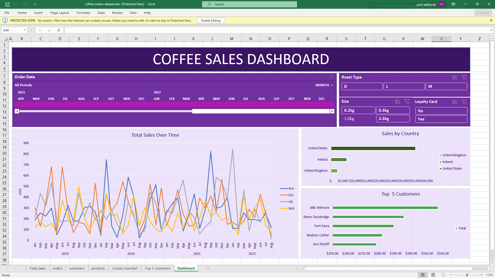
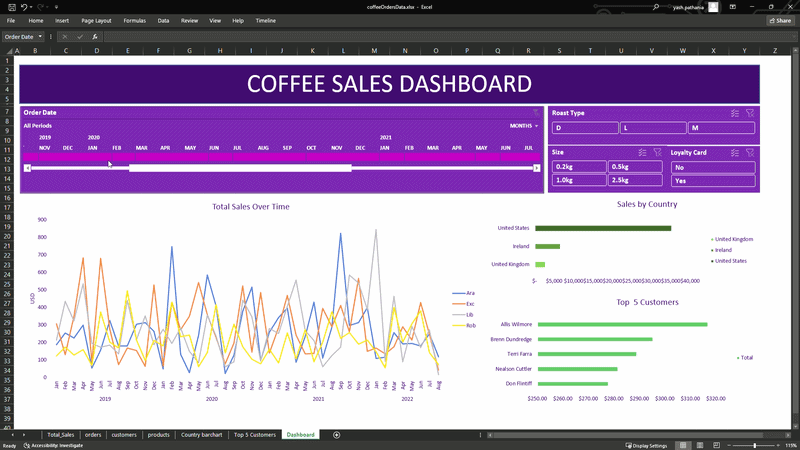

# ☕ Coffee Sales Analytics Dashboard (Excel)

## 📌 Project Overview

This project showcases an interactive Coffee Sales Analytics Dashboard built entirely in Microsoft Excel.

The dashboard transforms raw transactional sales data into structured business insights using relational lookup logic, pivot analysis, and interactive visual reporting.

The solution simulates real-world business reporting workflows using Excel as a data analysis tool.

---

## 🖼 Dashboard Preview

---

## 🎥 Dashboard Demo

---

## 🎯 Business Objective

The primary objectives of this analysis were:

- Analyze sales performance across countries  
- Identify top-performing customers  
- Evaluate impact of loyalty programs  
- Track sales trends over time  
- Compare product performance by roast type and size  

---

## 🛠 Tools & Techniques Used

- Microsoft Excel  
- Pivot Tables & Pivot Charts  
- Slicers & Timeline Filters  
- INDEX + MATCH (Multi-sheet lookup modeling)  
- Data Cleaning & Validation  
- Foreign Key Mapping  
- KPI Development  
- Dashboard Design Principles  

---

## 🧠 Data Modeling Approach

The dataset was structured across multiple sheets and connected using relational lookup logic.

Key technical implementations:

- Used **INDEX + MATCH** to join product-level data to transactional records  
- Resolved lookup alignment issues caused by blank rows  
- Debugged pivot cache inconsistencies  
- Ensured full formula propagation across dataset  
- Validated data integrity before dashboard build  

This mimics SQL-style joins within Excel.

---

## 📊 Key Insights

- United States generates the highest revenue contribution  
- Medium roast products show stable and consistent demand  
- Loyalty card holders demonstrate higher purchase value  
- Mid-year period shows peak seasonal sales  
- Revenue concentration observed among top customers  

---

## 📂 Dataset Description

The dataset includes:

- Order Date  
- Product ID  
- Roast Type  
- Size  
- Loyalty Card Status  
- Customer Name  
- Country  
- Sales Amount  

All fields were cleaned and standardized prior to analysis.

---

## 🚀 Skills Demonstrated

- Data Cleaning & Transformation  
- Relational Data Modeling  
- Lookup Debugging & Error Handling  
- Analytical Thinking  
- KPI Structuring  
- Business Insight Communication  

## 📁 Repository Structure
